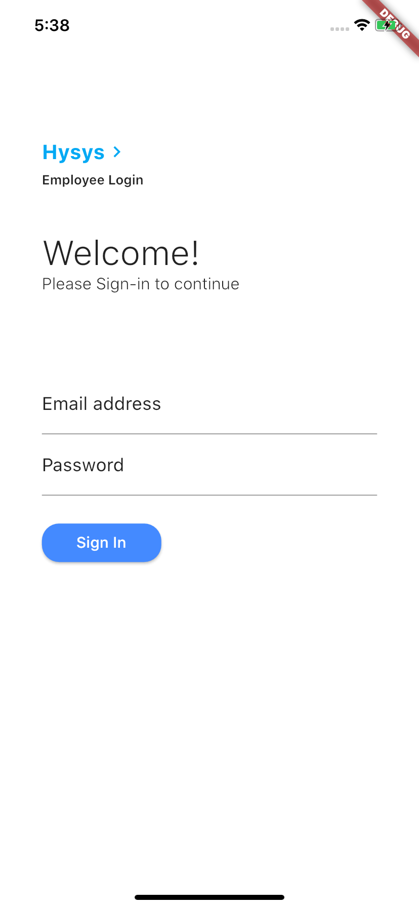
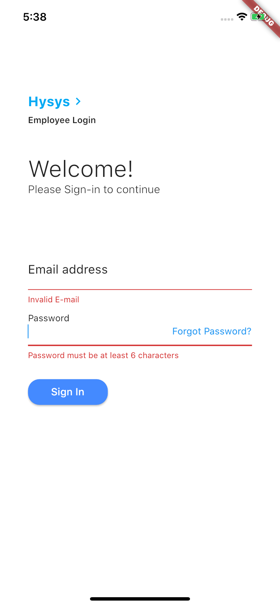
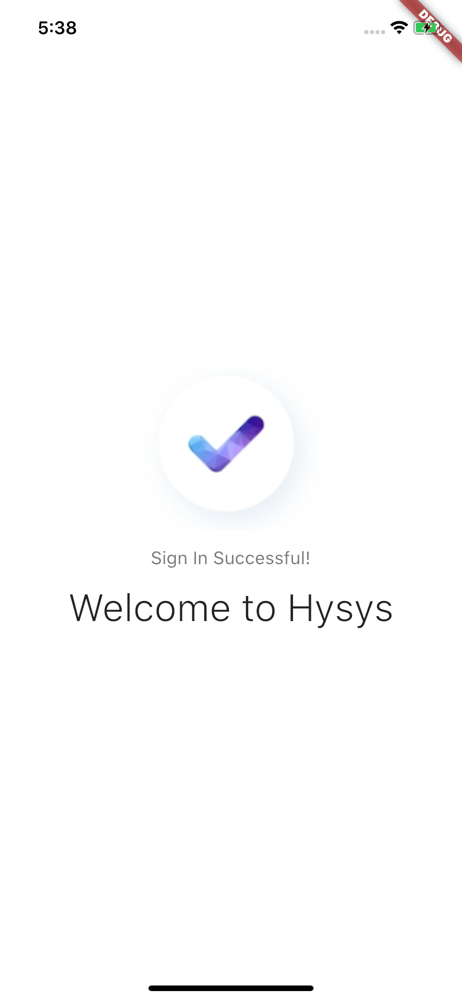

# Login Ekranı

Flutter'da login ekranı örneğidir.

## Login Ekranında Giriş İçin

- E-Mail: evrenvural4@gmail.com
- Şifre: 123456

## İçindekiler

- Responsive Tasarım
- Firebase Auth İşlemleri
- Form Validation

## Makale

[Form Validation](https://medium.com/@evrenvural/flutterda-validation-i%CC%87le-login-ekran%C4%B1-yap%C4%B1m%C4%B1-d8e7ad62134d)

## Kaynak

[Flutter Firebase Sign In - Veli Bacık](https://www.youtube.com/watch?v=bkZZVVRYTZY)

[Form Validation - Veli Bacık](https://www.youtube.com/watch?v=euVb0aD1bo0&start=25s)

## Ekran Görüntüleri

    

        
    

    

        
    

    

        
    

